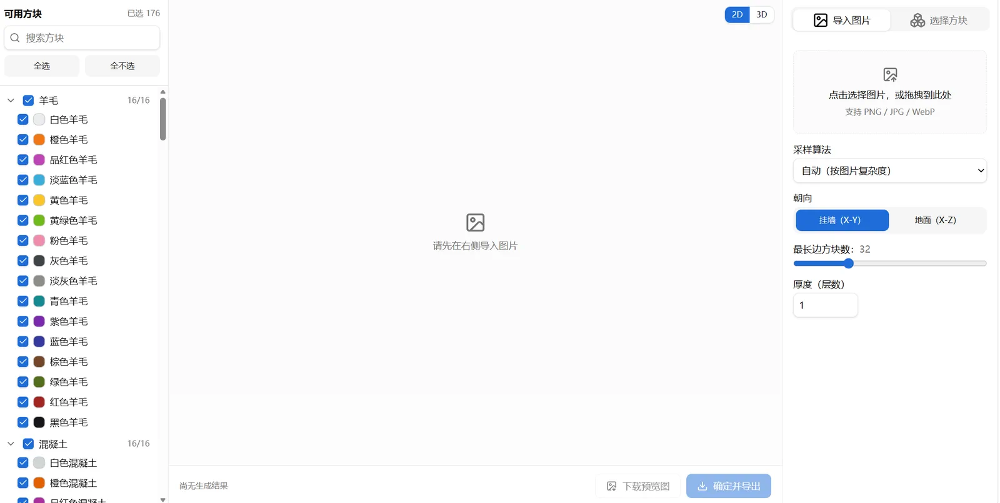
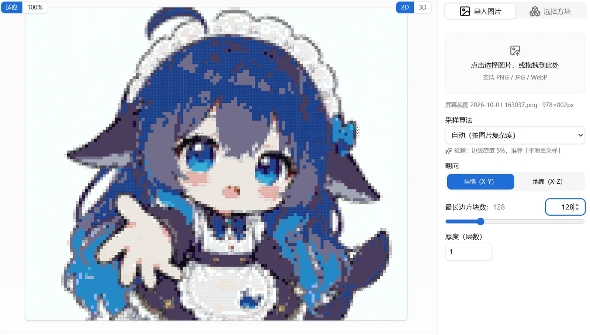
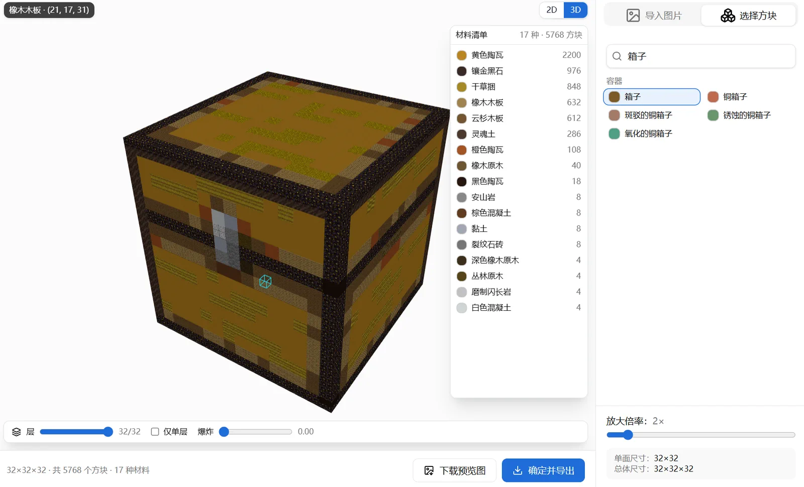
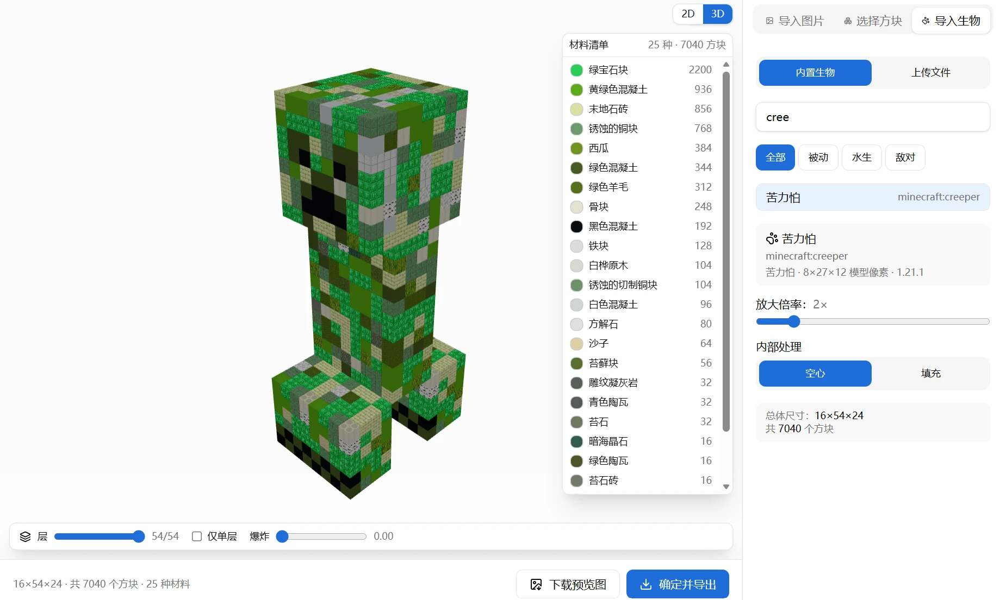
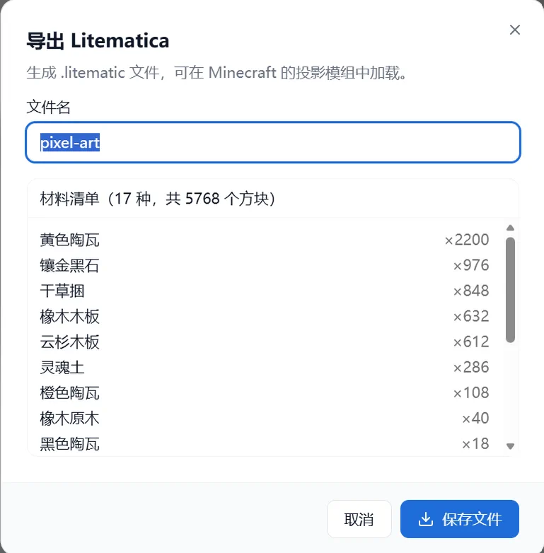

# MC Block Studio

把**图片**、**任意原版方块**或**生物体素**转换成 Minecraft 像素画（体素建筑），提供 2D 方块展开图与 3D 预览，并导出 `.litematic` 投影文件。



全部渲染与文件生成都在浏览器本地完成，**没有后端、不上传任何数据**。可离线使用。

## 功能预览

### 导入图片 → 像素画

照片 / 插画转成像素画，可切换朝向、调整尺寸与方块类型。



### 选择方块 → 3D 复刻

选一个原版完整方块（**内置方块**），生成中空放大的 3D 复刻（逐面贴图，最近邻采样保留原版像素风格）。

也可以切到**上传文件**，导入由 [**Block Capture**](https://github.com/yunfang1718128/block-capture) 模组在游戏内捕获的 `.mcvox` 方块包：楼梯、栅栏、火把、模组装饰这类**非完整立方体**会按真实形状还原，**箱子 / 告示牌 / 旗帜 / 床 / 潜影盒 / 头颅**这类由方块实体渲染的方块也一并支持，并可以调放大倍率、空心/填充。

配色面板的**「筛选不适合方块」**在方块模式下也能用：一键排除原木、草方块这类六面贴图不一致、摆放时容易露错面的方块。



### 导入生物 → 3D 体素

导入由 [**Entity Capture**](https://github.com/yunfang1718128/entity-capture) 模组导出的 `.mcvox` 生物捕获包（已内置 **82 种原版生物**，可搜索 / 按分类筛选；上传页附模组 GitHub 链接），点击即渲染 3D 预览；可调放大倍率、空心/填充，匹配方块后导出。



### 导出投影

一键导出 `.litematic` 投影文件，放进存档即可用投影模组放置。



## 下载 / 在线使用

- 网页版：<https://yunfang1718128.github.io/mc-block-studio/>
- Windows 桌面版（免费）：[Gitee Releases](https://gitee.com/yunfan1718128/mc-block-studio/releases/download/v0.4.0/MC%20Block%20Studio_0.4.0_x64-setup.exe)（国内高速） · [GitHub Releases](https://github.com/yunfang1718128/mc-block-studio/releases)

## 配套项目

两个姊妹模组把游戏内的模型采集成本工具能读的 `.mcvox`，它们与 studio 之间**只通过这一份格式耦合**：

- **[Entity Capture](https://github.com/yunfang1718128/entity-capture)** —— **Fabric / NeoForge** 客户端模组，把任意实体（含模组生物）按 1:1 原生分辨率捕获（带搜索 / 分类筛选 / 多选批量捕获）。捕获包导入「导入生物」页签。
- **[Block Capture](https://github.com/yunfang1718128/block-capture)** —— **Fabric / NeoForge** 客户端模组，把任意方块（含模组方块，非完整立方体也支持）按 16 单位/方块 捕获；约 128 个靠方块实体渲染的方块状态（箱子 / 告示牌 / 旗帜 / 床 / 潜影盒 / 头颅等）也能拿到。捕获包导入「选择方块」→「上传文件」。

```
[Entity Capture 模组]  游戏内捕获实体 ─┐
                                      ├─►  .mcvox  ─►  本工具：放大 → 空心/填充 → 匹配方块 → 导出 .litematic
[Block Capture 模组]   游戏内捕获方块 ─┘
```

两个模组写出的文件是同一种容器（`MCVX` v1），方块捕获只在头部多了 `subject: "block"` 与 `blockState`，所以两边可以互换使用。

## 技术栈

Vite · React 19 · TypeScript · Tailwind CSS v4 · three.js · Zustand · pako · Tauri v2（桌面壳）

## 本地开发

```bash
pnpm install
pnpm dev          # 开发服务器 http://localhost:5173
pnpm test         # 单元测试（vitest）
pnpm typecheck    # tsc --noEmit
pnpm build        # 类型检查 + 生产构建

pnpm sample:capture   # 造一个生物捕获样例，试「导入生物」
pnpm sample:block     # 造一个楼梯形状的方块捕获样例，试「选择方块 → 上传文件」
```

## 构建 Windows 桌面版

需要 Rust 工具链（含 MSVC）与系统 WebView2 运行时（Win10/11 已内置）。

```bash
pnpm desktop:dev     # 桌面开发模式
pnpm desktop:build   # 生成 NSIS 安装包，输出在 src-tauri/target/release/bundle/
```

## 数据来源

方块贴图与调色板由 `Mojang/bedrock-samples`（MIT）生成，见 [`NOTICE`](./NOTICE)。
重建目录：`pnpm fetch:blocks` + `pnpm build:blocks`。

## 许可证

GPL-2.0-only，见 [`LICENSE`](./LICENSE)。
